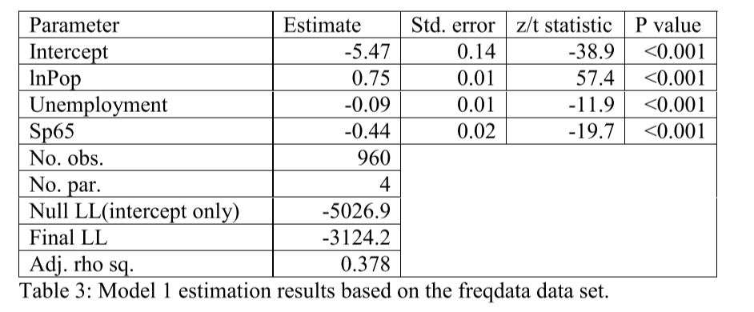
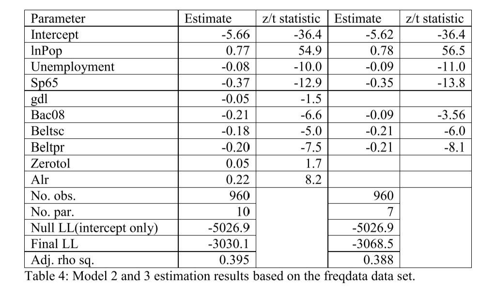

```{r setup, include=FALSE}
knitr::opts_chunk$set(echo = TRUE)
```

```{r, message = FALSE}
library(tidyverse)
library(mosaic)
library(readxl)
library(lmtest)
```

```{r}
data_ex2 <- read_excel("data/freqdata.xlsx")
head(data_ex2)
```
# --------------------- Section A -----------------------------
*Make descriptive statistics, e.g. a table with summary statistics and a correlation matrix, and discuss the results, for the variables that you are going to use (read the whole exercise first to decide which variables are relevant in the descriptive statistics).*

```{r}
fav_df <- rbind(
  favstats(data_ex2$lnpop),
  favstats(data_ex2$unempl),
  favstats(data_ex2$sp65),
  favstats(data_ex2$gdl),
  favstats(data_ex2$bac08),
  favstats(data_ex2$beltsc),
  favstats(data_ex2$beltpr),
  favstats(data_ex2$zerotol),
  favstats(data_ex2$alr),
  favstats(data_ex2$fatal)
)
row.names(fav_df) <- c("ln(population)", "unemployment rate", "speed limit 65", "graduated driver license law", "Blood alcohol < 0.08 law", "Secondary seat belt law", "Primary seat belt law", "Zero tolerance alcohol law", "License revocation law", "fatalities")
fav_df <- fav_df  %>% round(digits=2)
fav_df
```

corr_matrix <- cor(round(select(data_ex1,-c("ID")), digits=2))
corrplot(corr_matrix, method = 'ellipse', order = 'AOE', type = 'upper')

```{r}
library(corrplot)
corr_matrix <- data_ex2 %>% select(c(lnpop, unempl, sp65, gdl, bac08, beltsc, beltpr, zerotol, alr, fatal)) %>% cor()
round(corr_matrix, digits=3)
corrplot(corr_matrix, method = 'ellipse', order = 'AOE', type = 'upper')
```
We notice a high positive correlation between the variables representing regulatory actions aimed towards limiting reckless driving behavior.

# --------------------- Section B -----------------------------
*Table 3 shows the estimation results from a Poisson regression with the number of accidents as dependent variable and using lnPop, unempl and sp65 as explanatory variables. Comment on the results.*


The first value that we look at, is the adjusted $\rho^2$. The formula for $\rho^2$ is:

```{r}
1- (-3124.2/-5026.9)
```

# Comment on interpretation of values.

And, similarly to adjusted $R^2$, it represents the amount of variation that is explained by the model (Final LL), compared to a model with no parameters (Null LL). So the explanatory variables included in the model *log(Population), Unemployment rate, Speed limit of 65 mph law* are explaining some of the variation present in our measurements of the response-variable, the number of casualties in traffic among 16 year olds. We also see the p-values reflecting the t-test for the null-hypothesis of the variables having no influence on the mean being very low, meaning there is a high degree of statistical evidence that can let us reject the null-hypothesis of the variables being insignificant.

We see that population is positively correlated with the response variable. Which makes sense, as the presence of people is an essential requirement for people to get into traffic accidents. The unemployment rate has a negative correlation with the number of accidents. Perhaps because unemployed people are driving less, or have less access to vehicles. And finally we see that a speed limit of 65 mph has a reducing effect on the number of casualties.


# --------------------- Section C -----------------------------
*Table 4 shows the estimation results from two other Poisson regressions with the number of accidents as dependent variable and additional explanatory variables. Comment on the differences among the models in Tables 3 and 4 and argue which model you prefer, e.g. by the use of LR tests as well as by looking at the signs of parameters.*


Here we see two models. One model is including all the variables listed in the table, and the other model has excluded variables *gdl, Zerotol and Alr*. First thing we notice is that the adjusted $\rho^2$ is very close for the two models.

We can evaluate the two models against eachother by the log-likelihood ratio test

$LLR = -2 * (LL(\hat{\beta}_k) - LL(\hat{\beta}_p))\sim \chi^2_{f=k-p}$
So the $LLR$ test statistic is $\chi^2$ distributed over degrees of freedom equal to the difference in number of parameters between the two models

```{r}
teststat <- -(2) * (-3068.5 - (-3030.1))
teststat
```
We use the pchisq function to evaluate this statistic over a $\chi^2$ distribution with degrees of freedom = $9-6$

```{r}
pchisq(teststat, df = 9-6, lower.tail=FALSE)
```
This p-value represents the amount of evidence supporting the null-hypothesis that the simpler model is equally as good at explaining the variance in the dataset, as the model with more parameters. With a p-value of ~0, we can reject the null-hypothesis. 

So it seems that some of the additional variables *gdl, Zerotol and Alr* are significant at explaining the amount of variance. The variable that jumps out as most interesting to explore is alr, as it has the highest estimated effect. If we look at the correlation matrix we also see that it is positively correlated with the other two variables *zerotol* and *gdl*. So we try to reconstruct the extended model:

```{r}
poisson_extended <- glm(fatal ~ lnpop + unempl + sp65 + bac08 + beltsc + beltpr, data=data_ex2, family=poisson(link="log"))
summary(poisson_extended)
```
And we create the simple model, but this time with *alr* included:

```{r}
poisson_simple_alr <- glm(fatal ~ lnpop + unempl + sp65 + bac08 + beltsc + beltpr + alr, data=data_ex2, family=poisson(link="log"))
summary(poisson_simple_alr)
```
And we run the $LLR$ test for these two models:


```{r, message = FALSE}
lrtest(poisson_extended, poisson_simple_alr)
```

Now we have some evidence supporting the null-hypothesis at a significance-level of 0.10. We cannot reject the null-hypothesis that these two models are similar.

```{r}
data_ex2$elasticity_lnpop=0.78
data_ex2$elasticity_unempl=data_ex2$unempl*-0.09

fav_df <- rbind(
  favstats(data_ex2$elasticity_lnpop),
  favstats(data_ex2$elasticity_unempl)
)
row.names(fav_df) <- c("ln(population)", "unemployment rate")
fav_df <- fav_df  %>% round(digits=3)
fav_df
```
```{r}
df2 <- data_ex2
model3 <- -5.62 + 0.78*data_ex2$lnpop - 0.09*data_ex2$unempl - 0.35*data_ex2$sp65 - 0.09*data_ex2$bac08 - 0.21*data_ex2$beltpr - 0.21*data_ex2$beltsc
model3_nosp65 <- -5.62 + 0.78*data_ex2$lnpop - 0.09*data_ex2$unempl - 0.09*data_ex2$bac08 - 0.21*data_ex2$beltpr - 0.21*data_ex2$beltsc
model3_nobac08 <- -5.62 + 0.78*data_ex2$lnpop - 0.09*data_ex2$unempl - 0.35*data_ex2$sp65 - 0.21*data_ex2$beltpr - 0.21*data_ex2$beltsc
model3_nobeltpr <- -5.62 + 0.78*data_ex2$lnpop - 0.09*data_ex2$unempl - 0.35*data_ex2$sp65 - 0.09*data_ex2$bac08 - 0.21*data_ex2$beltsc

marginal_effect_sp65 <- exp(-0.35)-1
marginal_effect_bac08 <- exp(-0.09)-1
marginal_effect_nobeltpr <- exp(-0.21)-1
c(marginal_effect_sp65, marginal_effect_bac08, marginal_effect_nobeltpr)
```


```{r}
res <- resid(poisson_extended)
plot(fitted(poisson_extended), res)
abline(0,0)
qqnorm(res)
qqline(res)
plot(density(res))
```
```{r}
plot(poisson_extended)
```

```{r}
plot(poisson_extended, which = 4)
```
```{r}
plot(poisson_extended, which = 5)
abline(h=3)
abline(h=-3)
abline(v=0.05)
```

```{r}
df <- dffits(poisson_extended)
plot(dffits(poisson_extended), pch="*", cex=2, main="Influential Obs by DFFIT")  
abline(h = 0.4, col="red")   
abline(h = -0.4, col="red")  
text(x=1:length(df), y=df, labels=ifelse(df>0.4, names(df),""), col="red", pos = 4)
text(x=1:length(df), y=df, labels=ifelse(df<(-0.4), names(df),""), col="red", pos = 4) 

```


```{r}
plot_dfbetas <- function(model){
  dfbts <- dfbetas(model)
  #par(mfrow=c(ncol(dfbts)%/%2 + ncol(dfbts)%%2,2))
  for (x in colnames(dfbts)){
    plot(dfbts[,x], ylab=x)
    abline(h = 4/sqrt(nrow(dfbts)), col = "red")
    abline(h = -4/sqrt(nrow(dfbts)), col="red")
    text(names(dfbts[,x][abs(dfbts[,x]) > 4/sqrt(nrow(dfbts))]), dfbts[,x][abs(dfbts[,x]) > 4/sqrt(nrow(dfbts))], labels=names(dfbts[,x][abs(dfbts[,x]) > 4/sqrt(nrow(dfbts))]),  cex=0.9, font=2)
  }
}
  
```


```{r}
plot_dfbetas(poisson_extended)
```

```{r}
dfbetas <- dfbetas(poisson_extended)
dfbetas <- as_tibble(dfbetas)
medians <- cbind(
  median(dfbetas$`(Intercept)`),
  median(dfbetas$lnpop),
  median(dfbetas$unempl),
  median(dfbetas$sp65),
  median(dfbetas$gdl),
  median(dfbetas$bac08),
  median(dfbetas$beltsc),
  median(dfbetas$beltpr),
  median(dfbetas$zerotol),
  median(dfbetas$alr)
)
colnames(medians) <- colnames(dfbetas)

dfbetas_infl <- rbind(
  medians,
  dfbetas %>% slice(807,812, 811)
)
rownames(dfbetas_infl) <- c("median",807,812,811)
dfbetas_infl
  
```


```{r}
plot(dfbetas[,"lnpop"])
```


```{r}
ols_plot_dfbetas(poisson_extended)
```


```{r}
g <- ols_plot_resid_lev(poisson_extended)
```

